 &nbsp; 

 

 

 

## Trabajo seleccionado

| Proyecto | Stack | Qué es | Estado |
| --- | --- | --- | --- |
| **niko-ide-verilog** | `TypeScript` | - | privado |
| **niko-agents** | `Python` | - | privado |
| **Jose_Sanchez_PM_2025_C2** | `C` | Repositorio con las tareas de Programación para Mecatrónicos del C2 del ITLA. | privado |
| **[game-guard](https://github.com/Nikorasu-Vanetti/game-guard)** | `Python` | Bloqueo de videojuegos por horario en Windows | público |
| **moneyboxrd-ios** | `Swift` | - | privado |
| **moneyboxrd-android** | `Java` | - | privado |
| **[Windows-Startup-Manager](https://github.com/Nikorasu-Vanetti/Windows-Startup-Manager)** | `Python` | Aplicación en Python con interfaz gráfica para optimizar Windows. Permite gestionar programas de inicio y deshabilitar servicios en segundo plano no esenciales de forma totalmente segura. Esta abierta a modificaciones! | público |

 

## Acerca de

Construyo herramientas para desarrolladores, agentes de IA y sistemas embebidos/mecatrónicos. Dedico la mayor parte del tiempo a diseñar IDEs y automatizaciones que vuelven simple lo difícil, trabajando en todo el stack desde el navegador hasta el silicio.

- Web y tooling: TypeScript, JavaScript, editores/IDE a medida
- Sistemas y embebidos: C, C++, Verilog (FPGAs Tang Primer), mecatrónica en el ITLA
- IA y automatización: agentes en Python, orquestación de flujos
- Móvil: Swift, Kotlin / Java

Todo este perfil está generado por código. La cabecera, las métricas, el gráfico de lenguajes y la lista de proyectos se renderizan con datos reales de los repos mediante [`generate.py`](./generate.py) y se refrescan solos con una GitHub Action. Nada aquí se edita a mano.

 

_Última actualización: 2026-06-21 03:37 UTC_

