 

 

 

## Selected work

<!-- PROJECTS:START -->
| Project | Stack | What it is | Status |
| --- | --- | --- | --- |
| **niko-ide-verilog** | `TypeScript` | - | private |
| **niko-agents** | `Python` | - | private |
| **Jose_Sanchez_PM_2025_C2** | `C` | Repositorio con las tareas de Programación para Mecatrónicos del C2 del ITLA. | private |
| **[game-guard](https://github.com/Nikorasu-Vanetti/game-guard)** | `Python` | Bloqueo de videojuegos por horario en Windows | public |
| **moneyboxrd-ios** | `Swift` | - | private |
| **moneyboxrd-android** | `Java` | - | private |
| **[Windows-Startup-Manager](https://github.com/Nikorasu-Vanetti/Windows-Startup-Manager)** | `Python` | Aplicación en Python con interfaz gráfica para optimizar Windows. Permite gestionar programas de inicio y deshabilitar servicios en segundo plano no esenciales de forma totalmente segura. Esta abierta a modificaciones! | public |
<!-- PROJECTS:END -->

 

## About

I build developer tooling, AI agents and embedded/mechatronics systems. Most of
my time goes to designing IDEs and automation that make hard things feel simple,
working across the stack from the browser down to the silicon.

- Web & tooling: TypeScript, JavaScript, custom IDE/editor surfaces
- Systems & embedded: C, C++, Verilog (Tang Primer FPGAs), mechatronics at ITLA
- AI & automation: Python agents, workflow orchestration
- Mobile: Swift, Kotlin / Java

The contents of this profile are generated by code. The header, the metrics, the
language chart and the project list above are all rendered from live repository
data by [`generate.py`](./generate.py) and refreshed automatically by a GitHub
Action. Nothing here is updated by hand.

 

<!-- UPDATED:START -->
_Last refreshed: 2026-06-21 02:34 UTC_
<!-- UPDATED:END -->

<!-- profile readme: Nikorasu-Vanetti -->
